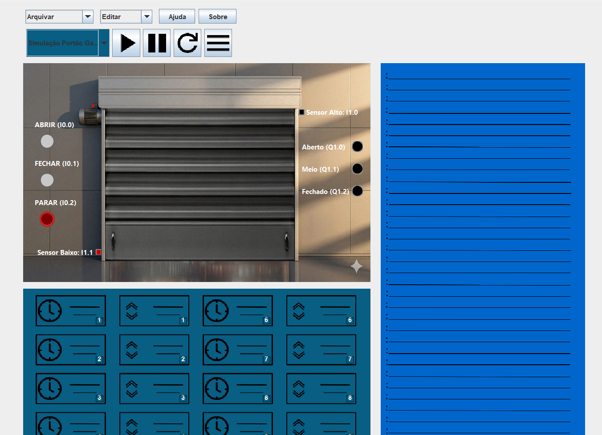

# 🤖 Simulador de CLP com Interface Interativa (Instruction List - IL)

📚 **Disciplina:** Controladores Lógicos Programáveis (CLP)

🎓 **Curso:** Engenharia de Computação

🏫 **Instituição:** IFTM - Instituto Federal do Triângulo Mineiro

📍 **Campus:** Uberaba - Parque Tecnológico

👨‍🏫 **Professor:** Robson Rodrigues

---

## 👥 Alunos

- **Gabriel Augusto de Oliveira Silva**
- **Robson William Teixeira Junior**
- **Vinicius Alves Soares**

---

## 📌 Descrição Geral do Projeto

O projeto consiste na criação de um ambiente de simulação de um CLP (Controlador Lógico Programável) no computador, com interface interativa para operar as entradas e saídas disponíveis no simulador de processo industrial.

O ambiente segue o ciclo de funcionamento de um CLP real e se inspira em simuladores existentes, como o LogixPro.

Este projeto utiliza como referência a implementação desenvolvida por Diogo Nunes Batista, disponível no seguinte repositório:
🔗 [Repositório de Referência (Diogo-NB)](https://github.com/Diogo-NB/SimuladorClp)

---

## 🛠️ Funcionalidades Implementadas

### 📝 Lista de Instruções Suportadas (Instruction List - IL)

O simulador suporta as seguintes instruções baseadas na norma IEC 61131-3:

- **LD:** Load – Carrega um valor para o acumulador.
- **LDN:** Load Negado – Carrega um valor negado para o acumulador.
- **ST:** Store – Armazena o conteúdo do acumulador no local especificado.
- **STN:** Store Negado – Armazena o conteúdo negado do acumulador no local especificado.
- **AND:** AND – Função booleana AND entre o operando indicado e o valor do acumulador.
- **ANDN:** AND Negado – Função booleana AND entre o operando indicado negado e o valor do acumulador.
- **OR:** OR – Função booleana OR entre o operando indicado e o valor do acumulador.
- **ORN:** OR Negado – Função booleana OR entre o operando indicado negado e o valor do acumulador.
- **TON:** Temporizador ON Delay – Ativa após um intervalo de tempo definido.
- **TOF:** Temporizador OFF Delay – Desativa após um intervalo de tempo definido.
- **CTU:** Count Up – Contador crescente.
- **CTD:** Count Down – Contador decrescente.

**Endereçamento:**
- **T1, T2, T3...:** Temporizadores.
- **I0.0, I1.7...:** Entradas do sistema.
- **Q0.1, Q1.7...:** Saídas do sistema.
- **M1, M2, M3...:** Memórias booleanas locais.

---

### ✅ Data Table (Tabela de Variáveis)

- Ferramenta visual para monitorar o estado de todas as variáveis do sistema em tempo real.
  _(Inspirado na Data Table do LogixPro)_

### ✅ Modos de Operação

- 🛠️ **PROGRAM:** Permite a edição do código IL, sem leitura de entradas ou escrita nas saídas físicas.
- ⏸️ **STOP:** Interrompe a execução da lógica; o sistema para.
- ▶️ **RUN:** Executa o ciclo de varredura (scan) e processa a lógica do usuário continuamente.

### ✅ Ciclo de Varredura do CLP Simulado

O simulador respeita a ordem de execução padrão:
1. Inicializa o sistema.
2. Lê as entradas físicas e armazena na memória imagem de entrada.
3. Processa o programa do usuário (lógica IL).
4. Atualiza as saídas físicas com base na memória imagem de saída.
5. Retorna ao passo 2.

### ✅ Persistência de Dados

- Funcionalidade para **salvar** o código desenvolvido e **carregar** programas salvos anteriormente.

### ✅ Linguagem de Programação

- **Instruction List (IL)** - Texto estruturado conforme requisitos da disciplina.

### ✅ Exemplos Práticos

O projeto inclui 3 exemplos funcionais demonstrando:
1. Operações lógicas básicas.
2. Uso de Temporizadores (TON/TOF).
3. Uso de Contadores (CTU/CTD).

### ✅ Instalação

- O projeto dispõe de um **instalador executável (.exe)** para facilitar a execução em ambiente Windows.

---

## 🎨 Interface do Projeto

*(Insira aqui um print da tela do simulador de vocês)*

---

## ▶️ Demonstração

*(Insira aqui o link para o vídeo do grupo de vocês, caso tenham gravado)*

---

## 📚 Referências

- Projeto de Referência: [https://github.com/Diogo-NB/SimuladorClp](https://github.com/Diogo-NB/SimuladorClp)
- LogixPro Simulator (The Learning Pit).